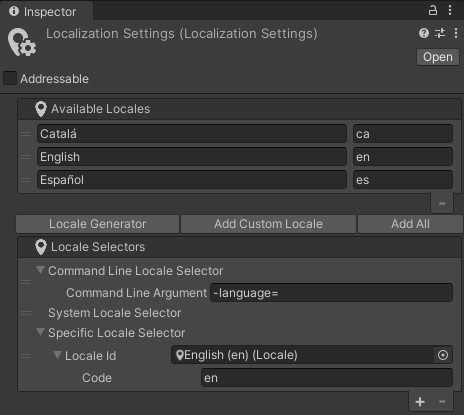
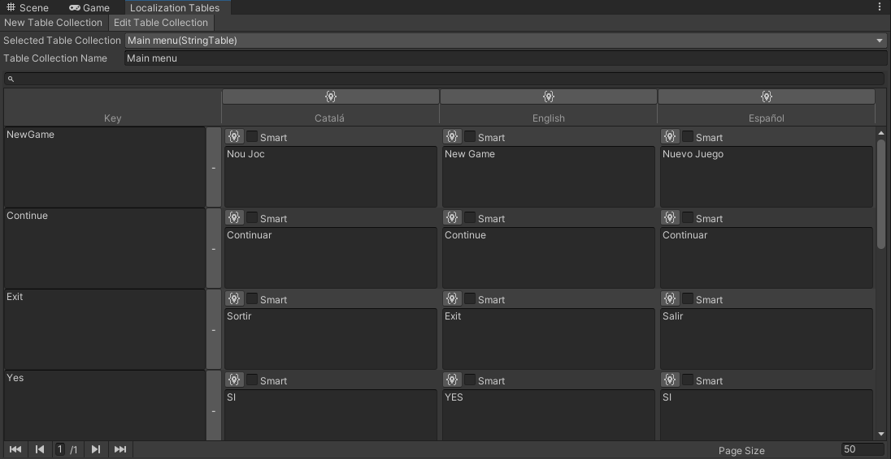
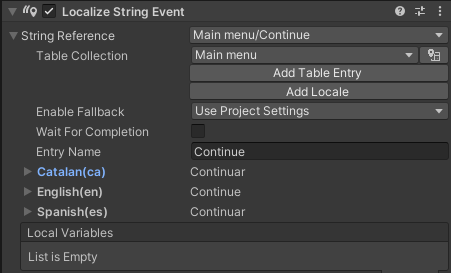
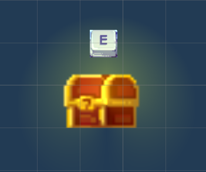

# PEC 3

# 1. Notas de la versión 1.1

## 1.1. Corrección de errores

>- Se ha corregido un error que provocaba que las monedas y los rubíes no se guardasen correctamente.
>- Se ha corregido el salto astronauta.
>- Se han ajustado los valores del jugador y los enemigos. Ahora el gameplay será un poco más fluído.
>- Se ha corregido un error por el que el jugador podía seguir realizando acciones cuando estaba muerto o con el juego en pausa.

## 1.2. Nuevo contenido

>- Se han añadido más detalles gráficos a las escenas del bosque, el castillo y la torre.
>- Se ha implementado la localización de los textos. Los idiomas disponibles son:
>   - Castellano
>   - Inglés
>   - Catalan
>- Se ha añadido un nuevo movimiento, el dash: En el aire pulsa la tecla Q para realizar un desplazamiento (este movimiento no genera invulnerabilidad).
>- Se ha implementado el salto progresivo. El salto se hará más alto en función del tiempo en el que la tecla de espacio esta pulsada.
>- Se ha implementado el doble salto. En el aire se puede pulsar la tecla de espacio para volver a saltar.
>- Se ha implementado el roll. Estando en el suelo pulsando el botón secundario del ratón se puede realizar el roll (este movimiento gener invulnerabilidad).
>- Se ha implementado un sistema de dialogos.
>- Se ha implementado la subida de nivel mediante rubíes.
>- Se ha añadido una nueva escena, la tienda:
>   - En la tienda un misterioso personaje nos venderá objetos a cambio de oro.
>- Se ha implementado la Cinemachine como cámara principal.
>- Se han añadido efectos de iluminación en entornos, objetos y personajes.
>- Se ha implementado la transición entre escenas, el cambio ya no se hará de forma abrupta y sin delay.
>- Se han añadido efectos de partículas para representar el daño en los personajes.
>- Se han añadido particulas al jugador para reforzar el feedback de los movimientos al jugador:
>   - Correr
>   - Saltar
>   - Dash
>   - Roll
>- Se ha implementado un menú de opciones en la escena del menú inicial para seleccionar el idioma de la aplicación.
>- Se ha implementado una escena para mostrar los créditos.
>- Se ha añadido la versión del juego en la pantalla principal.

# 2. Nuevas pantallas
## 2.1. La tienda

# 3. Nuevas acciones del jugador

## 3.1. Salto progressivo
## 3.2. Doble salto
## 3.3. Dash
## 3.4. Roll
## 3.5. Dash VS Roll
## 3.6. Subir de nivel
## 3.7. Comprar objetos

# 4. Sistema de dialogos
Desde los primeros momentos de diseño del juego tenía pensado implementar un sistema de dialogos. Creo que en un juego de este estilo es una aportación bastante importante.

# 4.1. Funcionamiento

# 5. Localización del juego
Todo desarrollador busca que su juego pueda llegar al mayor número de personas posible. Por este motivo siempre es muy aconsejable traducir todos los textos del juego como mínimo.
Para hacer esta parte incialmente tenía pensado utilizar un excel donde cada columna era un idioma y la primera fila era el código del idioma.
Buscando maneras eficaces de implementar esto he dado con un paquete de Unity llamado Localization que implementa este sistema.
Su utilización es un poco engorrosa al principio pero una vez se coge práctica la utilización es bastante metódica.
Lo primero es crear un Location para cada idioma que queremos tener. En mi caso he creado el de catalán, castellano y inglés.

El siguiente paso es crear la localization table. La localization table nos permite asignar un identicador a los Location que queramos y a su vez, indicar la cadena que queremos que representar en cada uno.

En mi caso he creado múltiples tables, unaa para cada escena del juego y otra para el menú de pausa que se encuentra en todas las escenas.
Finalmente queda utilizar estas tablas. Se puede hacer directamente en el inspector de un GameObject de Text o TextMeshPro añadiendo un String Event.

# 6. Iluminación

# 7. Objetos interactuables
Hay ciertos objetos sobre los que el jugador puede interactuar con ellos con la tecla E. El problema que tenía era que no era posible saber con que objetos era capaz de interactuar.
Para facilitar esto he añadido una funcionalidad nueva en la que se muestra al jugador la tecla de interacción cuando pasa cerca de un objeto interactuable.
A todos los objetos interactuables les he añadido un GameObject (como hijo) con un SpriteRender con la imagen de la tecla de interacción. Este GameObject por defecto lo pongo en disabled para que no se vea.
Seguidamente he aprovechado el collider con trigger que ya tenía el objeto para añadir el enable del GameObject.
Finalmente he añadido el OnTriggerExit del jugador para volver a ocultar el sprite.

