## Índice

- [1. Notas de la versión 1.1](#1Notas-de-la-versión-1.1)
  - [1.1. Corrección de errores](#11Corrección-de-errores)
  - [1.2. Nuevo contenido](#12Nuevo-contenido)
- [2. Nuevas pantallas](#2Nuevas-pantallas)
  - [2.1. La tienda](#21-la-tienda)
- [3. Nuevas acciones del jugador](#3-nuevas-acciones-del-jugador)
  - [3.1. Salto progressivo](#31-salto-progressivo)
  - [3.2. Doble salto](#32-doble-salto)
  - [3.3. Dash](#33-dash)
  - [3.4. Roll](#34-roll)
  - [3.5. Subir de nivel](#35-subir-de-nivel)
  - [3.6. Comprar objetos](#36-comprar-objetos)
- [4. Sistema de dialogos](#4-sistema-de-dialogos)
  - [4.1. Funcionamiento](#41-funcionamiento)
- [5. Localización del juego](#5-localización-del-juego)
- [6. Iluminación](#6-iluminación)
- [7. Objetos interactuables](#7-objetos-interactuables)
- [8. El jefe final](#8-el-jefe-final)
- [9. Transición entre escenas](#9-transición-entre-escenas)
- [10. Cosas pendientes](#10-cosas-pendientes)
- [11. Recursos de terceros utilizados](#11-corrección-de-errores)

# Notas de la versión 1.1

## 1.1. Corrección de errores

>- Se ha corregido un error que provocaba que las monedas y los rubíes no se guardasen correctamente.
>- Se ha corregido el salto astronauta.
>- Se han ajustado los valores del jugador y los enemigos. Ahora el gameplay será un poco más fluído.
>- Se ha corregido un error por el que el jugador podía seguir realizando acciones cuando estaba muerto o con el juego en pausa.

## 1.2. Nuevo contenido

>- Se han añadido más detalles gráficos a las escenas del bosque, el castillo y la torre.
>- Se ha implementado la localización de los textos. Los idiomas disponibles son:
>   - Castellano
>   - Inglés
>   - Catalan
>- Se ha añadido un nuevo movimiento, el dash: En el aire pulsa la tecla Q para realizar un desplazamiento (este movimiento no genera invulnerabilidad).
>- Se ha implementado el salto progresivo. El salto se hará más alto en función del tiempo en el que la tecla de espacio esta pulsada.
>- Se ha implementado el doble salto. En el aire se puede pulsar la tecla de espacio para volver a saltar.
>- Se ha implementado el roll. Estando en el suelo pulsando el botón secundario del ratón se puede realizar el roll (este movimiento genera invulnerabilidad).
>- Se ha implementado un sistema de dialogos.
>- Se ha implementado la subida de nivel mediante rubíes.
>- Se ha añadido una nueva escena, la tienda:
>   - En la tienda un misterioso personaje nos venderá objetos a cambio de oro.
>- Se ha implementado la Cinemachine como cámara principal.
>- Se han añadido efectos de iluminación en entornos, objetos y personajes.
>- Se ha implementado la transición entre escenas, el cambio ya no se hará de forma abrupta y sin delay.
>- Se han añadido efectos de partículas para representar el daño en los personajes.
>- Se han añadido particulas al personaje para reforzar el feedback de los movimientos al jugador:
>   - Correr
>   - Saltar
>   - Dash
>   - Roll
>- Se ha implementado un menú de opciones en la escena del menú inicial para seleccionar el idioma de la aplicación.
>- Se ha añadido un nuevo ataque al jefe final, el Rush. Ahora el jefe cargará durante unos momentos y realizará una embestida en la dirección del jugador.
>- Se ha añadido la versión del juego en la pantalla principal.

[Video con la demo](videos/Presentation.mp4)

# 2. Nuevas pantallas

## 2.1. La tienda
La tienda es una pequeña escena donde un misterioso personaje nos venderá objetos a cambio de monedas de oro.
Solo hay disponibles tres objetos: La espada pesada, la posición de corazón y la poción de salud.

# 3. Nuevas acciones del jugador

## 3.1. Salto progressivo

Para hacer el salto progresivo he divido el salto en dos partes la primera es el salto en si, en la que se detecta cuando se pulsa la tecla de salto, y la segunda parte donde se mira que se este manteniendo pulsada la tecla de salto.
He añadido una varible que representa al tiempo que se puede realizar esta acción, de esta manera no podemos estar saltando hasta el infinido. Esta variable se resetea en el momento en el que el jugador toca el suelo.

## 3.2. Doble salto

Para implementar el doble salto he añadido una variable booleana para saber si puedo volver a saltar. Con esto cada vez que se pulsa la barra espaciadora se mira si el jugador esta en el suelo o si puede hacer el doble salto. Una vez dentro dependiendo de si el jugador no esta tocando el suelo se actualiza la variable booleana de doble salto.
El valor de la variable se reinicia en el método que comprueba si el jugador esta tocando el suelo.
Al hacer esto e visto que el feedback del doble salto era casi nulo y al jugador le costaba ver cuando había hecho el doble salto. Para solucionar esto le he añadido un sistema de partículas blancas pequeñas a los píes del personaje y cada vez que se realiza la acción de saltar se reproduce.

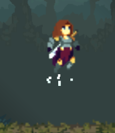

## 3.3. Dash
Me parecía interesante añadír esta habilidad al personaje para un juego de este esticlo. Creo que aporta más dinamismo en los combates y plataformas. He decidido restringir esta habilidad para que solo se pueda utilizar en el aire. Me he encotrado con un problema, al añadir la velocidad y la fuerza al rigidbody la gravedad afecta a este y el personaje no se queda en el aire, va bajando y perdiendo velocidad. Además no había restringido el movimiento y el jugador podía pulsar las teclas de movimiento. Esto hacía que la velocidad del desplazamiento fuese muy errática.
Entonces el siguiente paso es bloquear el resto de acciones mientras estemos haciendo el dash. Además para que siempre tengamos la sensación de que se ejecuta de la misma forma he puesto la velocidad del Rigidbody a 0.
Finalmente queda el problema de la gravedad, buscando en la documentación de Unity he visto que el Rigidbody tiene el atributo gravityScale. Lo he puesto a cero al inicio de la habilidad y he restaurado el valor al terminarla.
Como esta acción se tiene que realizar en una sucesión de diferentes frames la he montado en una corutina.

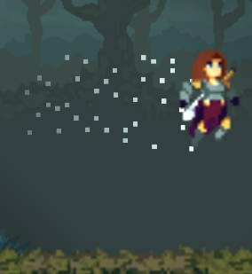

## 3.4. Roll
El roll es una habilidad que había empezado a implementar en la entrega de la PAC2 pero no estaba la animación bien hecha ni la funcionalidad. He querido dar al jugador de una herramienta para poder evitar ataques de forma rápida. Esto a supuesto una série de pequeños retos.
En primer lugar había que arreglar las animaciones y definir un tiempo de roll para saber cuanto tiempo tenemos que aplicar la invulnerabilidad. El segundo es hacer que se aplique esta invulnerabilidad.
He utilizado un sistema parecido al del dash, al fin y al cabo es el mismo desplazamiento pero en el suelo.
Aquí me he dado cuenta de un problema, el jugador, los enemigos, los objetos y el escenari tienen coliders. Esto hace que el personaje no pueda atravesarlos y los arrastre. Además de que saltaban los métodos OnTriggerEnter y hacían daño al jugador.
Mi primer intento fué pensar en poner el RigidBody en Kinematic, esto hacía que funcionase pero podía atravesar las paredes por lo que he descartado esta opción.
Investigando un poco el sistema de física en Unity he visto la interacción entre layers. He aprovechado esto anteriormente con el sistema de ataque. Todos los enemigos se encuentran en la layer Hit, por lo que he creado una nueva layer para el roll. Finalmente he indicado al sistema de físicas 2D que las capas Hit y rolling.

> Physics2D.IgnoreLayerCollision(LayerMask.NameToLayer("Hit"), LayerMask.NameToLayer("Rolling"));

De forma que he puesto esta habilidad en una corutina en la cual al principio se pone la velocidad del rigidbody a 0, se cambia la layer del jugador y se da el impulso al rigidbody. Espero el tiempo de la habilidad y vuelvo a poner el layer del personaje a Hit.
Con esto faltaba una cosa, indicar a los enemigos en el método OntriggerEnter que el jugador es invulnerable. Para esto he añadido un método que el enemigo consulta antes de hacer el ataque y ya tenemos el movimiento hecho.
Para acabar he añadido un clip de audio y un sistema de partículas para transmitir feedback al jugador.

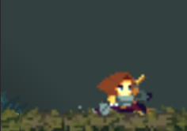

## 3.5. Subir de nivel
He querido utilizar el coleccionable de los rubíes para representar la ganancia de experiéncia y subir de nivel. He definido que la subida de nivel comporta para el jugador un aumento de la salud. Hasta un máximo de 10 corazones.
Para hacer esto he añadido un valor en los niveles del jugador, que indica el siguiente número de rubíes que se necesita para subir de nivel.
Con esto he actualizado la interfaz para que se muestre al usuario cuantas le faltan para subir de nivel.

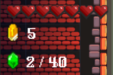

En el momento en el que se llega al límite para subir de nivel se descuentan los rubíes y se indica el nuevo rango de subida. Para hacer esto aprovecho el método PickUpRuby pero en este caso le paso los rubíes que tiene el jugador con un valor negativo.
Además para aportar feedback al usuario he añadido un clip de audio para la subida de nivel y un sistema de partículas doradas que salen del personaje hacia fuera.

## 3.6. Comprar objetos

Finalmente tenemos la compra de objetos. Esta acción esta limitada a la tienda y solo a los objetos que esten disponibles.
He aprovecha la funcionalidad de interactuar con objetos. La principal diferencia es que ahora tenemos dos actores más, el ShopManager y el GameManager. En el momento en el que se quiere comprar un objeto se indica al ShopManager que objeto queremos comprar. Este pregunta al GameManager si podemos comprarlo. El GameManager es el que tiene la información de juego y entre esos datos esta la cantidad de monedas que tiene el jugador. En el momento en el que se puede realizar la compra el ShopManager indica al GameManager que se realiza la compra. En este momento el GameManager debe descontar las monedas y aplicar los beneficios del objeto.
Para descontar las monedas he aprovechado el método de PickUpCoin, pero en este caso en vez de pasarle un valor positivo, le paso el precio del objeto en negativo. Esto actualiza el valor y salta la animación de los coleccionables donde el jugador puede ver que sus monedas han disminuído.
Por otro lado el ShopManager se encarga de eliminar el objeto y ejecutar las animaciones y sonidos correspondientes a la compra.

# 4. Sistema de dialogos
Desde los primeros momentos de diseño del juego tenía pensado implementar un sistema de dialogos. Creo que en un juego de este estilo es una aportación bastante importante.

# 4.1. Funcionamiento

El sistema de dialogos esta divido en tres partes: La interfaz, el DialogManager y el TriggerDialog.

La interfaz es un canvas que tiene una caja de texto, un botón y una imagen.
El DialogTrigger es el encargado de hacer saltar la secuencia de dialogos. Lo pongo en un GameObject con un collider2D en trigger. De esta manera cuando el jugador llega a la zona concreta salta el dialogo. Para la información de los dialogos tengo una clase serializable compuesta por el texto y la imagen del personaje que esta realizando el dialogo. El valor del texto no es un string al uso porque va a estar traducido y la variable tiene que tiene que ser del tipo LocalizedString. Con esto formamos la sentencia a mostrar y se indica en el inspector de Unity. 

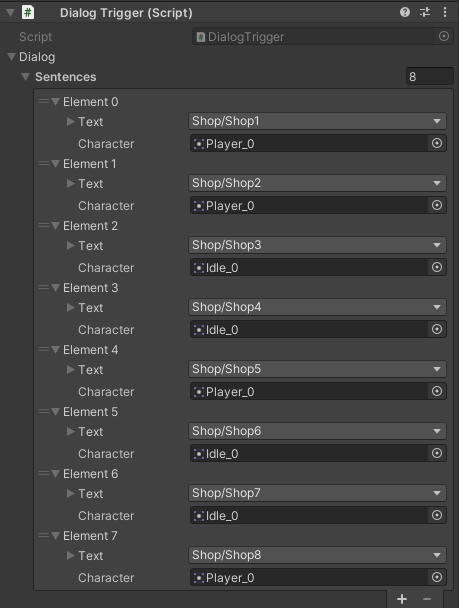

Finalmente esta el DialogManager que se encarga de recibir la información del trigger y prepararla para que se muestre en la interfaz.
En el momento en el que salta el trigger el DialogManager prepara las sentencias. En este caso las guardo en una cola de Sentencias para mantener el orden de entrada/salida. Una vez que tiene todo procesado preparo el dialogo. En primer lugar se subtituye la imagen por la que toca en ese dialogo. Después mediante una subrutina se escribe el texto. He querido hacer que tenga el efecto de que se va escribiendo el texto. Por eso en cada frame inserto un carácter nuevo.
Finalmente falta el sistema para hacer avanzar el dialogo. En este caso es el botón continuar de la interfaz. Hace saltar una acción en el DialogManager para desencolar la cola y repetir el mismo proceso hasta que la cola este vacía. Llegado este momento se ejecuta la animación de salida de la interfaz y se termina el dialogo.
Para evitar que el dialogo se ejecute múltiples veces en el trigger, después de avisar al DialogManager este se destruye.

# 5. Localización del juego
Todo desarrollador busca que su juego pueda llegar al mayor número de personas posible. Por este motivo siempre es muy aconsejable traducir todos los textos del juego como mínimo.
Para hacer esta parte incialmente tenía pensado utilizar un excel donde cada columna era un idioma y la primera fila era el código del idioma.
Buscando maneras eficaces de implementar esto he dado con un paquete de Unity llamado Localization que implementa este sistema.
Su utilización es un poco engorrosa al principio pero una vez se coge práctica la utilización es bastante metódica.
Lo primero es crear un Location para cada idioma que queremos tener. En mi caso he creado el de catalán, castellano y inglés.

El siguiente paso es crear la localization table. La localization table nos permite asignar un identicador a los Location que queramos y a su vez, indicar la cadena que queremos que representar en cada uno.

En mi caso he creado múltiples tables, unaa para cada escena del juego y otra para el menú de pausa que se encuentra en todas las escenas.
Finalmente queda utilizar estas tablas. Se puede hacer directamente en el inspector de un GameObject de Text o TextMeshPro añadiendo un String Event.

# 6. Iluminación

Para añadir iluminación he añadido el paquete Universal RP. Preparar el paquete para usarlo es un poco engorroso. Hay que hacer una nueva pipeline e indicar en el project settings que la utilice. Además como ya tenía niveles creados he tenido que renderizar todas las escenas para que utilicen el sistema de luces en 2D.

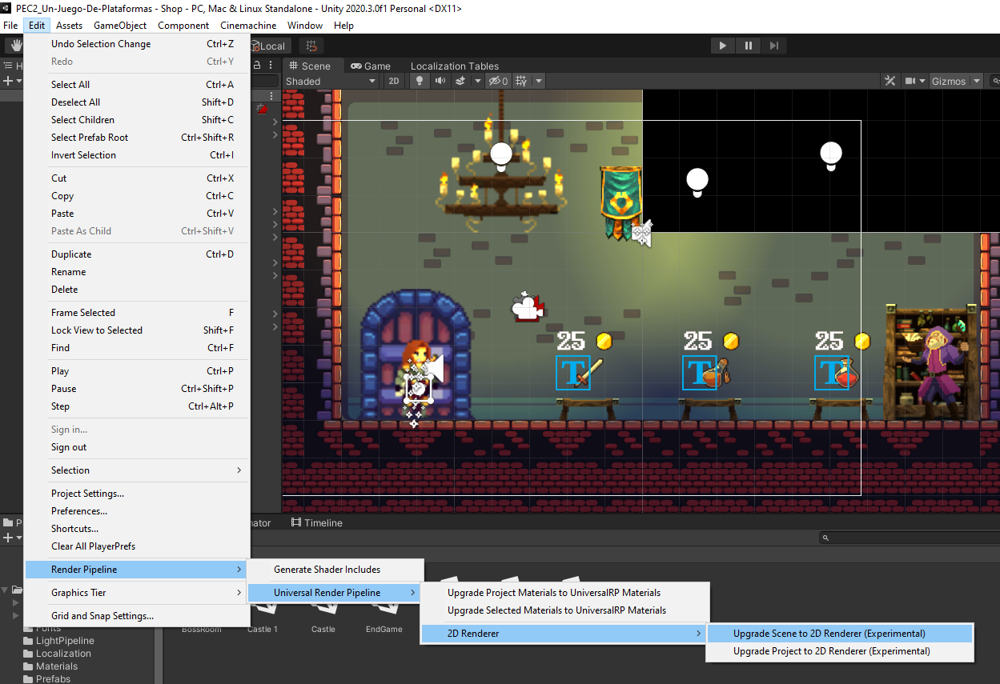

Después de esto toda la escena queda a oscuras y se puede empezar a añadir luces.
En mi caso en todas las escenas he añadido una luz global un poco más ténue y he añadido luces a diferentes elementos:

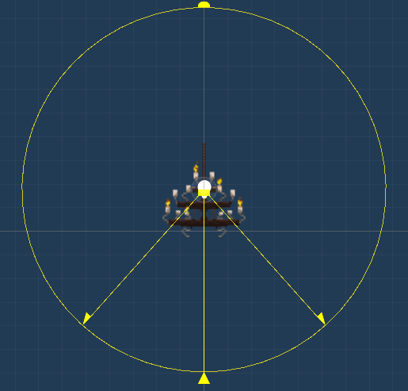

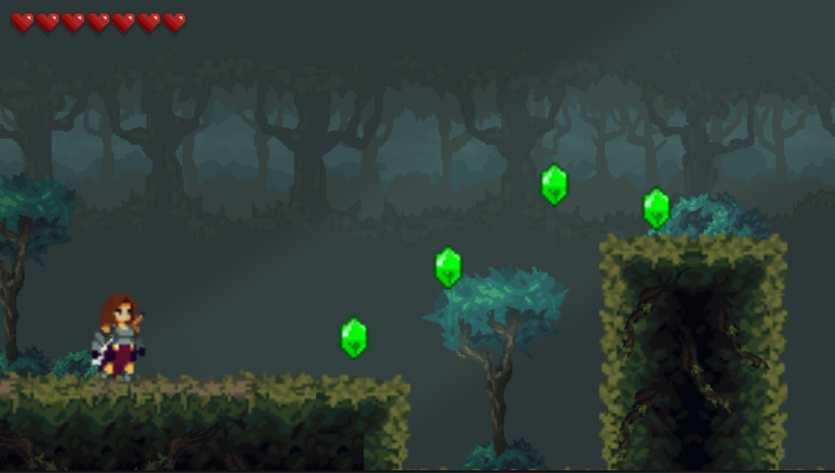

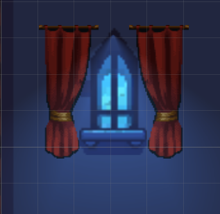

# 7. Objetos interactuables

Hay ciertos objetos sobre los que el jugador puede interactuar con ellos con la tecla E. El problema que tenía era que no era posible saber con que objetos era capaz de interactuar.
Para facilitar esto he añadido una funcionalidad nueva en la que se muestra al jugador la tecla de interacción cuando pasa cerca de un objeto interactuable.
A todos los objetos interactuables les he añadido un GameObject (como hijo) con un SpriteRender con la imagen de la tecla de interacción. Este GameObject por defecto lo pongo en disabled para que no se vea.
Seguidamente he aprovechado el collider con trigger que ya tenía el objeto para añadir el enable del GameObject.
Finalmente he añadido el OnTriggerExit del jugador para volver a ocultar el sprite.

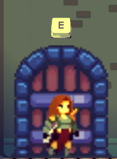

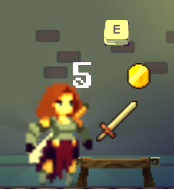

# 8. El jefe final
Se ha mejorado el ataque del jefe final. Ahora es más preciso. Para hacer esto he cambiado el método de ataque. Antes en el Update se ejecutaba el ataque y miraba si el jugador estaba dentro del rango, y si estaba dentro espera el tiempo de ataque. Esto provocaba que si el jugador se movía muy rápido salía de la zona de ataque y el ataque se cancelaba.
Ahora el código de ataque lo he movido a una corutina que se activa cuando el jugador esta dentro del rango de ataque y el enemigo no esta atacando.
Dentro de esta corutina se espera el tiempo de ataque y realiza el ataque.
Finalmente le he añadido un ataque nuevo, el Rush. Con este ataque el enemigo se queda quieto un momento y carga en la dirección del jugador.
Para hacerlo he añadido otra corutina, en la cuál el enemigo espera el tiempo de carga y después carga aumentando la velocidad de movimiento con la velocidad de Rush.
Ahora que tengo dos ataques tengo que decidir cuando se va a utilizar cada uno. De momento lo he dejado con un sistema de probabilidades donde el ataque cuerpo tiene una probabilidad de ejecutarse del 65%, el resto para la nueva habilidad del rush. Para añadir un poco más de feedback en este ataque he añadido un sonido y un sistema de partículas para dar la sensación de que se esta moviendo rápidamente.

# 9. Transición entre escenas

El cambio entre escenas se estaba haciendo de forma abrupta y no quedaba bien. He querido añadir un pequeño efecto para que esto se haga de una forma más agradable para el jugador.
Para hacer esto he añadido un canvas con una imagen en negro. A esto le he añadido dos animaciones, una de entrada y otra de salida. Estas animaciones lo que hacen es poner la transparencia de la imagen al máximo y mínimo respectivamente. Las dos animaciones tienen una duración de un segundo.
Al iniciar la escena arranca la animación de salida y desde una pantalla en negro vamos viendo la escena. Esto siempre pasa por defecto al inicio de cada escena.
Para la carda de una escena nueva solo tengo que ejecutar la animación de entrada y indicar al SceneManager que quiero que cargue la escena en un segundo. De esta manera podemos ver como la pantalla se pone en negro y despues se aclara con la nueva escena.
Esto me ha generado un problema, como se trata de un canvas me estaba dando interferencias con el sistema de diálogos y el menú de pausa. Investigando un poco he visto que esto se debe a que se quedaba ese canvas por encima y no permitía que interactuase con el resto de elementos. Para solucionar esto he añadido en la animación que quite el interactable al terminar.

# 10. Cosas pendientes

Como cosas pendientes he dejado elementos de la tienda. Ahora mismo solo se pueden comprar tres objetos, faltaría poder añadir más. Tampoco tengo un histórico de compras por lo que al volver a cargar la escena se pueden volver a comprar los items.
Por otro lado al volver a la escena del castillo todos los collecionables se cargan por lo que es posible farmear hasta los cofres.

# 11. Recursos de terceros utilizados

- Sprites del Castillo: <a href="https://blackspirestudio.itch.io/medieval-pixel-art-asset-free" target="_blank">Medieval pixel art</a>, by BlackPire Studio.
- Sprites del cofre: <a href="https://admurin.itch.io/free-chest-animations" target="_blank">Free Chest Animations</a>, by Admurin.
- Srites de las monedas y rubíes: <a href="https://laredgames.itch.io/gems-coins-free" target="_blank">Gems/Coins</a>, by La Red Games.
- Sprites de los enemigos: <a href="https://luizmelo.itch.io/monsters-creatures-fantasy" target="_blank">Monsters Creatures Fantasy</a>, by Luiz Melo.
- Sprites del jugador: <a href="https://clembod.itch.io/warrior-free-animation-set" target="_blank">Warrior Free Animation Set</a>, by Clembod.
- Sprites del sistema de salud: <a href="https://fliflifly.itch.io/hearts-and-health-bar" target="_blank">Hearths and Health Bar</a>, by Vampire Girl.
- Sprite de la poción: <a href="https://cheekyinkling.itch.io/shikashis-fantasy-icons-pack" target="_blank">shikashis fantasy icons pack</a>, by Cheekyinkling.
- Temas musicales: <a href="https://svl.itch.io/rpg-music-pack-svl" target="_blank">RPG Music Pack</a>, by SVL.
- Sprites de la pantalla de incio: <a href="https://brullov.itch.io/2d-platformer-asset-pack-castle-of-despair" target="_blank">2D Platformer Asset Pack</a>, by Brullov.
- Sprites de la caja: <a href="https://blackdragon1727.itch.io/items-and-traps-16x16-pixel" target="_blank">Items And Traps</a>, by BlackDragon1727.
- Sprites del bosque: <a href="https://szadiart.itch.io/platformer-fantasy-set1" target="_blank">Platformer Fantasy Set1</a>, by Szadiart.
- Sprites de la barra de salud del Jefe: <a href="https://www.pixilart.com/draw/health-bar-sprite-sheet-04dbaae0250b710" target="_blank">Health Bar Sprite Sheet</a>, by Desconocido.
- Sprites de la pantalla de fin de partida: <a href="https://aethrall.itch.io/demon-woods-parallax-background" target="_blank">Demon Woods Parallax Background</a>, by Aethrall.
- <a href="https://mixkit.co/free-sound-effects/sword/" target="_blank">Clip de audio de espada</a>
- Clips de audio: <a href="https://www.dreamstime.com/stock-music-sound-effect/collect-jewel-03.html">Collect Jewel</a>
- Interfaz de diálogo: <a href="https://paperhatlizard.itch.io/cryos-mini-gui" target="_blank">Cryos mini gui, by PaperHatLizard</a>
- Sprite tecla de interactuar: <a href="https://cazwolf.itch.io/caz-pixel-keyboard" target="_blank">Pixel Fantasy RPG Icons, by Caz</a>
- Sprites del encargado de la tienda: <a href="https://luizmelo.itch.io/wizard-pack" target="_blank">Wizard pack, by Luiz Melo</a>
- <a href="https://www.fesliyanstudios.com/royalty-free-sound-effects-download/spells-and-power-ups-217" target="_blank">Clip de audio de la subida de nivel</a>
- <a href="https://www.findsounds.com/ISAPI/search.dll?keywords=cash+register" target="_blank">Clip de audio de compra de Item</a>
